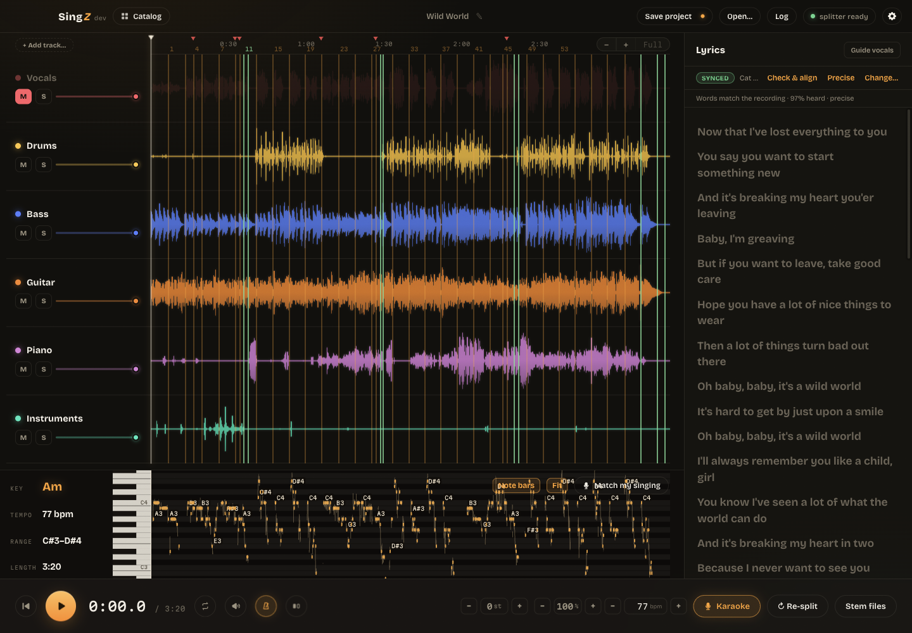

# SingZ

A practice app for singers. Drop a song, see its timeline, split it into stems
(vocals / drums / bass / instruments) with AI, and mute any track while it plays —
kill the vocals and it's your karaoke machine.



Cross-platform desktop app: Electron + React + TypeScript, Web Audio for
sample-locked multitrack playback, [Demucs](https://github.com/adefossez/demucs)
(htdemucs) running locally for stem separation. No cloud, no accounts.

**Karaoke mode**: hit the Karaoke button after splitting and SingZ mutes the
vocals, transcribes them into word-timed lyrics with a bundled
[whisper.cpp](https://github.com/ggml-org/whisper.cpp) (shown in a side panel
with live word-by-word highlighting — click a line to jump there), extracts the
vocal melody, and scrolls it as a pitch lane. Turn on the mic and it tracks your
singing against the melody (octave-agnostic) with a live match score. The speech
model (~466 MB) is downloaded once by the app itself, after asking you first;
`SINGZ_WHISPER_MODEL` picks another size (tiny/base/small/medium).

## Run it

```bash
npm install
npm run dev
```

## Stem separation setup (one-time)

SingZ shells out to the Demucs CLI. Install it with pipx (needs Python 3.10–3.13):

```bash
pipx install demucs && pipx inject demucs numpy
```

The app finds `demucs` on PATH, in `~/.local/bin`, or Homebrew's bin — or set the
`SINGZ_DEMUCS` env var to a custom command (e.g. `"python3 -m demucs"`). The first
split downloads the htdemucs model (~80 MB). A typical song takes a few minutes of
CPU; results are cached per file in the app's user-data dir, so a song is only ever
split once.

`ffmpeg` is recommended so Demucs can read MP3/M4A (`brew install ffmpeg`).

## How it works

- **Main process** ([src/main](src/main)) — spawns/parses Demucs with progress,
  caches stems by content hash, and serves audio to the renderer over a locked-down
  `singz://` protocol (only registered files + the stems cache are readable).
- **Preload** ([src/preload](src/preload)) — small typed bridge (`window.singz`):
  file-path resolution for drops, IPC, progress events.
- **Renderer** ([src/renderer](src/renderer)) — React UI. `MultitrackEngine` plays
  all stems as AudioBufferSources scheduled on one AudioContext clock (sample-sync),
  with per-track gain ramps for click-free mute/solo/volume. Waveforms are canvas
  peak envelopes; the playhead drives a CSS variable so progress costs no redraws.

Keyboard: **space** play/pause, **←/→** seek ±5 s, **Esc** closes karaoke.
Scrub by dragging the timeline.

Dev note: the transcription engine is a vendored static binary — build it once
with `scripts/vendor-whisper.sh` (needs cmake); CI builds it for every platform
automatically and electron-builder bundles it from `vendor/<platform>-<arch>/`.

## Build & releases

```bash
npm run build      # bundles main/preload/renderer into out/
npm run typecheck
npm run dist       # package an installer for the current platform (electron-builder)
```

CI ([.github/workflows/build.yml](.github/workflows/build.yml)) builds macOS
(arm64 + x64 dmg) and Windows (x64 NSIS installer) on every `v*` tag and attaches
them to the GitHub Release; it can also be run manually from the Actions tab
(artifacts only). Cut a release with:

```bash
git tag v0.2.0 && git push origin v0.2.0
```

Builds are unsigned for now — macOS users right-click → Open on first launch,
Windows shows a SmartScreen prompt. To sign, remove `identity: null` from
[electron-builder.yml](electron-builder.yml) and add certificate secrets in CI.
