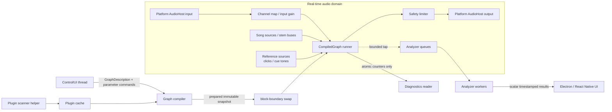

# Future DSP graph architecture

Status: roadmap; Phase 0A and the Phase 0B contract/prototype slice are implemented
Last reviewed: 2026-08-26
Foundation: PR #13, squash commit `a76a8d997143e12727bc37de0f19fda652d97f6b`

Implementation research: [DSP-IMPLEMENTATION-RESEARCH.md](DSP-IMPLEMENTATION-RESEARCH.md)

Native language, target and layout design: [NATIVE-CORE-DESIGN.md](NATIVE-CORE-DESIGN.md)

Phase 0B contracts and decisions: [ADRs](adr/)

Performance evidence: [DSP-PERFORMANCE-BASELINE.md](DSP-PERFORMANCE-BASELINE.md)

This document is the implementation plan for moving SingZ from two fixed
playback graphs plus a capture pipeline to one reusable, low-latency native DSP
engine. It is intentionally parked until a feature needs the next phase. Each
phase is independently shippable and must preserve the current player while it
is proved on real hardware.

## Product goal

The engine must support:

- song playback and phase-coherent stem mixing;
- microphone input, channel selection, metering and vocal scoring;
- generated notes, intervals and chords for Vocal Training;
- configurable built-in effects and analyzer taps;
- input monitoring and recording;
- desktop plug-ins, beginning with VST3;
- the same processor contracts for real-time and offline rendering;
- macOS, Windows, iOS and Android, with platform code in separate classes and
  per-OS files;
- honest latency across built-in DSP, plug-ins, device buffers and external
  routes such as Bluetooth, CarPlay and Android Auto.

This is an audio graph, not merely an insert chain. A chain is a useful preset,
but the engine must also represent buses, parallel branches, sidechains,
analyzer taps and explicit dry/wet paths.

## Decisions carried forward from the original proposal

The architecture proposal made during the Vocal Training work remains the
baseline. It specified:

- an immutable execution plan swapped atomically at block boundaries;
- preallocated planar audio buffers;
- no allocation, locks, logging, filesystem access or IPC on the real-time
  thread;
- configurable routing, parallel paths, dry/wet mixes and sidechains;
- per-node latency declarations with compensation across parallel paths;
- sample-accurate parameter events with smoothing;
- versioned, serializable graph presets;
- an offline runner using the same nodes;
- cheap bounded meters inline, with pitch/spectrum/ML analysis on bounded
  non-blocking taps;
- VST3 on Windows/macOS, Audio Units on Apple platforms and CLAP as a later
  adapter;
- discovery/scanning outside the audio process, with an explicit choice
  between lowest-latency in-process execution and safer bridged execution;
- a duplex shared clock where one device owns input and output, and drift
  correction when input and output use different clocks;
- monitoring disabled by default, with explicit output, gain and feedback
  controls.

PR #13 validates the source side of that proposal but adds an important
boundary: the existing `AudioInput` ring and `AudioInputSink` run through an
ordinary delivery thread. They remain the correct path for analyzers and
telemetry. They are **not** the future zero-extra-hop monitoring path. Direct
monitoring/effects must run from a full-duplex render-side callback/worker that
invokes the compiled graph in the device's real-time domain.

## Current state and migration constraints

Today SingZ has three separate audio paths:

1. Desktop playback is a fixed Web Audio graph in
   `src/renderer/src/audio/engine.ts`: lane `AudioBufferSourceNode`s feed lane
   gains, one master bus and an optional Signalsmith worklet. The metronome
   bypasses the master bus.
2. Mobile playback mirrors that shape in `mobile/src/engine.ts` using
   `react-native-audio-api`, including a patched native stretch node.
3. PR #13 added a shared float32 capture transport, now located under
   `zcore/`, with AUHAL, WASAPI, RemoteIO and AAudio
   providers, physical-channel selection, timestamp provenance, bounded
   delivery and an off-real-time 2,048/512 analysis adapter.

Phase 0A makes the reusable native source tree top-level `zcore/` and
establishes the sibling `zdsp/` package. `mobile/`, Electron and native
command-line tools are consumers of those libraries, not owners of their
source.

The migration must preserve these proven invariants:

- all song lanes start sample-locked;
- gain changes remain click-free;
- transpose stays phase-coherent by processing the summed song bus;
- metronome and other reference signals do not accidentally pass through song
  transpose, training ducking or arbitrary effects;
- the audible/display clock is distinct from the render/control clock. Mobile
  already enforces this; desktop currently uses its latency-adjusted
  `position` for training decisions, a divergence Phase 4 must correct using
  the mobile semantics as authoritative;
- capture timestamps remain raw and never include output-route latency;
- native mobile buffers are released deterministically, never left to GC;
- one owner configures each process-global audio session;
- raw callback PCM does not cross Electron or React Native IPC;
- device removal, timestamp-quality changes and discontinuities create an
  explicit boundary instead of silently joining incompatible audio.

## Target architecture



There are four ownership domains:

1. **Control domain** builds descriptions, validates user changes, prepares
   nodes and publishes complete snapshots.
2. **Real-time domain** owns no dynamic allocation and only runs a prepared
   graph for the current block.
3. **Analysis domain** consumes bounded taps and may drop work rather than
   delay sound.
4. **Plugin-service domain** scans unknown binaries and, in safe mode, hosts
   processing outside the app process.

## Core contracts

### Audio format and blocks

The graph's canonical sample representation is native-endian IEEE float32.
This matches the current shared capture core, Web Audio, RNAudioAPI and common
plug-in processing paths. Integer devices are converted once at the platform
edge; integer formats never propagate through the graph. The first plug-in
adapters request float32 support and reject/bypass float64-only instances with
an explicit capability error. Float64 may be added later without changing the
baseline graph format.

The canonical buffer layout is non-owning planar audio. Read-only and writable
views are different types so a processor cannot mutate a fan-out input merely
because the view object itself is const. Capture timing belongs to each input
bus; render and transport timing belong to the whole graph block:

```cpp
struct ConstAudioBusView {
  const float* const* channels;
  uint32_t channelCount;
  uint32_t frames;
  const CaptureTime* capture;  // null for non-capture/offline sources
};

struct MutableAudioBusView {
  float* const* channels;
  uint32_t channelCount;
  uint32_t frames;
};

struct CaptureTime {
  uint64_t clockDomainId;
  uint64_t streamGeneration;
  uint64_t sequence;
  uint64_t sourceFrame;
  uint64_t sampleHostTimeNs;
  uint64_t callbackHostTimeNs;
  AudioInputTimestampQuality quality;
  DiscontinuityReason discontinuity;
  uint32_t flags;  // validity and stale-anchor
};

struct RenderTime {
  uint64_t clockDomainId;
  uint64_t streamGeneration;
  uint64_t graphFrame;
  uint64_t renderHostTimeNs;
  uint64_t callbackHostTimeNs;
  uint32_t flags;  // validity and discontinuity
};

struct TransportContext {
  uint64_t validFields;
  bool playing;
  bool recording;
  bool cycling;
  int64_t projectTimeSamples;
  int64_t continuousTimeSamples;
  double tempo;
  double projectTimeMusic;
  double barPositionMusic;
  double cycleStartMusic;
  double cycleEndMusic;
  int32_t timeSignatureNumerator;
  int32_t timeSignatureDenominator;
};

struct ProcessContext {
  RenderTime time;
  const TransportContext* transport;  // null when unavailable
  double sampleRate;
  uint32_t frames;
  Span<const ParameterEvent> parameters;
  Span<const MusicalEvent> events;
  ScratchView scratch;
};
```

One compiled graph has one sample rate, a declared maximum block size and
declared bus layouts. A device callback and `GraphRunner` receive 1 through the
prepared maximum frames. Processor and plug-in adapters must additionally
tolerate a zero-frame call used only to flush parameter/events; they must not
read or write audio buffers in that call. Platform adapters
deinterleave/interleave and convert only at the boundary. A block-size adapter
is an explicit node/host utility, never an assumption hidden inside a
processor.

Before the first block after a generation change, sequence gap, sample-rate
change, route generation, timestamp-quality transition or hard clock
re-anchor, `GraphRunner` calls `reset()` on stateful dependent processors and
marks the block with a typed `DiscontinuityReason`. A captured bus never
inherits another bus's clock domain or provenance; offline sources leave
capture metadata absent.

### Processor lifecycle

The first native interface should stay small and format-neutral:

```cpp
enum class TailKind { None, Finite, Infinite };
struct TailInfo { TailKind kind; uint64_t frames; };

class AudioProcessor {
 public:
  virtual ~AudioProcessor() = default;
  virtual PrepareResult prepare(const PrepareSpec&, RealtimeArena&) = 0;
  virtual void reset() noexcept = 0;
  virtual void process(ProcessContext&, Span<const ConstAudioBusView> inputs,
                       Span<MutableAudioBusView> outputs) noexcept = 0;
  virtual uint32_t latencyFrames() const noexcept = 0;
  virtual TailInfo tail() const noexcept = 0;
};
```

Rules:

- `prepare` runs off the real-time thread and receives all durable memory.
- `process` may not allocate/free, lock, perform an OS/blocking wait, log, call
  filesystem/network APIs, call JNI/JSI or interact with the
  Objective-C/Swift runtime, or destroy another node. The only future
  exception is the explicitly budgeted real-time spin join described below.
- `reset` clears transitory state without changing parameters.
- node state serialization is a control-domain adapter, not a `process`
  method.
- bypass is defined for every processor. It must preserve declared latency so
  toggling bypass cannot shift parallel paths.
- processors report tail length so transport stop, offline render and graph
  replacement can handle reverbs/delays deliberately.
- a processor may write an input buffer only when the compiler grants an
  explicit in-place alias and no other live consumer can observe it.
- non-finite samples are contained at trust boundaries: device conversion and
  plug-in outputs replace NaN/Inf with zero, increment an atomic counter and
  request off-RT bypass after a bounded repeated-failure policy.

### Parallel execution policy

The first graph runner is serial. A later measured optimization may execute
independent expensive stages on a fixed, pre-created real-time worker pool. It
may use a spin join only with a precomputed absolute budget ending before the
device deadline; it never performs an OS wait. Each worker writes a
slot-private buffer. On a miss, the block uses a prepared emergency dry/silent
path and the miss is counted. The whole parallel stage/processor generation,
including its state and arena slots, is then quarantined until every late
worker acknowledges its epoch. Subsequent blocks use an independently prepared
fallback snapshot; they never invoke the same stateful processors serially
while a late worker may still mutate them. Only after acknowledgement may the
old generation be retired or reused and serial execution of those instances be
enabled. No worker writes directly to a returned device buffer. Small stages
and graphs with inadequate measured deadline margin remain serial.

### Graph description and compiler

`GraphDescription` is a versioned control-domain model containing stable node
IDs, type IDs, port connections, parameters and opaque adapter state. The
compiler must:

1. resolve node factories and versions;
2. validate port types, channel layouts, sample rate and maximum block size;
3. reject cycles in the first release; a later feedback path must contain an
   explicit delay node and a separately reviewed scheduling rule;
4. topologically order processors;
5. calculate buffer lifetimes and allocate/reuse all audio/scratch storage;
6. query intrinsic and plug-in latency;
7. insert delay compensation on shorter parallel paths;
8. prepare every node before publication;
9. return either a complete `CompiledGraph` or structured validation errors.

A bad description must never partially mutate the live graph.

### Atomic graph changes and retirement

The control thread builds and prepares the next `CompiledGraph`, then publishes
one pointer/generation. At the next callback boundary, `GraphRunner` swaps the
whole snapshot. The audio thread places the old generation on a fixed-capacity
retirement queue; destruction and plug-in deactivation happen off RT after an
epoch/callback acknowledgement proves no callback can still reference it.

Publication reserves retirement capacity before making a snapshot visible.
There is at most one pending snapshot: newer control-domain edits supersede and
destroy older unobserved snapshots off RT. When no retirement slot is
available, publication is deferred/coalesced on the control thread; RT never
blocks, allocates, destroys or leaks to make room.

A block boundary alone does not guarantee an inaudible transition. The
compiler also prepares a `TransitionPlan`:

- parameter-only changes use sample-accurate ramps;
- topology or latency changes crossfade old and new output over a bounded,
  preallocated interval with aligned latency;
- stateful replacements use an explicit state-transfer adapter when supported;
- finite old tails may render into a bounded tail-spill path; infinite tails
  require an explicit user/preset cut or fade policy;
- emergency/device-loss replacement may hard-cut, but records a discontinuity.

The control domain rejects/degrades a transition whose measured combined CPU
budget cannot safely run both plans; it does not discover that overload inside
the callback.

Never use `shared_ptr` destruction, arbitrary reference-count finalization or
node teardown on the audio callback. Reuse the intent of
`AudioInputCallbackGate`, but add an epoch-based snapshot retirement mechanism
rather than stopping the device for ordinary graph edits.

### Parameters and events

Parameters enter through fixed-capacity single-producer queues and are copied
into a preallocated per-block event span:

```cpp
struct ParameterEvent {
  NodeId node;
  ParameterId parameter;
  uint32_t sampleOffset;
  float value;
  ParameterCurve curve;
};
```

- Values are sample-accurate inside the block.
- Continuous UI changes are coalesced before they reach the audio thread.
- Each node declares whether a parameter is stepped or smoothed and its
  smoothing policy.
- Queue overflow is counted and reported; audio continues with the latest
  safely accepted value.
- Transport, tempo, beat position and note/MIDI-like events use a separate
  typed event port so they cannot be confused with scalar parameters.

### Latency and clock model

Latency is recorded as separate quantities, never collapsed into one guessed
number:

- capture device/buffer latency;
- input conversion/resampling latency;
- node and plug-in latency in frames;
- cross-process bridge latency, if selected;
- render device/buffer latency;
- external route latency and user trim;
- analyzer window/hop latency.

External routing is a versioned `RouteLatencySnapshot`, not a loose sum. It
carries route generation, source/provenance, confidence, the complete automatic
presentation estimate, optional component estimates and user trim, plus flags
that say which components are already included. iOS currently defines its
automatic value as `outputLatency + ioBufferDuration`. Android's measured
presentation queue is already the complete estimate and must not be summed
with its buffer fallback again. Route change invalidates the prior snapshot.
Trim affects audible display and scoring projection only, never capture PCM or
raw timestamps.

The graph compiler compensates only deterministic in-graph path latency. The
platform host exposes input and output clocks plus negotiated device latency.
The application maps graph/render time to the audible display clock using
output-route latency, while training gain changes remain on render time.
Analyzer results retain source sample time and provenance.

A duplex host uses the output/render clock as the graph clock. APIs such as
RemoteIO or ASIO may provide one duplex callback. APIs such as WASAPI or AAudio
may require coordinated capture and render streams; the host then transfers
capture through a bounded RT FIFO and maps both device positions to the graph
clock. Even when both endpoints name one physical device, the common-clock
assumption must be verified. Separate physical devices are always treated as
two clock domains: the FIFO measures fill error and an RT-safe variable-ratio
resampler corrects slow drift. A hard discontinuity resets dependent
processors and analyzers. The current `Resampler::process` is not
RT-guaranteed and must not be reused until it has a fixed-capacity RT wrapper
or replacement.

### Analyzer taps

An analyzer is not automatically a graph processor.

- Peak/RMS, clipping and other tiny fixed-cost meters may run inline.
- Pitch, spectrum, onset, formant and ML analyzers consume timestamped blocks
  from preallocated SPSC queues on worker threads.
- Every tap has an explicit channel policy, window, hop, queue depth and drop
  policy.
- If a worker falls behind, it drops/resets analysis continuity; the audio
  callback never waits.
- Results crossing app boundaries are timestamped scalar/vector telemetry,
  never a stream of raw callback PCM.

`LiveInputAnalysisAdapter` remains the first production tap adapter. It resets
on sequence gaps, rate changes and timestamp-quality transitions. Offline
whole-buffer analyzers such as pYIN melody tracking and key analysis are not
silently relabeled as real-time nodes.

### Sources, buses and sinks

Initial built-in node families:

- sources: captured input bus, decoded song/stem reader, oscillator, noise,
  metronome/cue and offline buffer;
- routing: channel map, split, merge, bus send/return, dry/wet and tap;
- dynamics/tone: gain, mute, polarity, gate, parametric EQ, compressor and
  safety limiter;
- time/pitch: the existing phase-coherent Signalsmith processor behind a
  native node contract;
- analysis: peak/RMS inline plus bounded pitch and spectrum taps;
- sinks: device output, recorder and offline buffer writer.

Song, microphone and reference buses stay distinct until the preset explicitly
mixes them. This keeps a metronome or pitch reference from being transposed,
ducked or recorded by accident.

## Platform host boundary

The graph owns DSP; an `AudioHost` owns devices, callbacks, negotiation and
session lifecycle:

```cpp
class AudioHost {
 public:
  virtual HostInventory enumerate() = 0;
  virtual HostOpenResult open(const HostConfig&, RealtimeRender) = 0;
  virtual HostStartResult start() = 0;
  virtual void stop() = 0;
  virtual HostStatus status() const = 0;
};
```

Each provider is a separate class in a separate OS file:

| Platform | Initial host | Later/optional host | Session owner |
| --- | --- | --- | --- |
| macOS | duplex AUHAL | Audio Unit plug-in adapter | native host coordinator |
| Windows | WASAPI shared/exclusive | ASIO after license gate | native host coordinator |
| iOS | duplex RemoteIO | AUv3 nodes later | one AVAudioSession coordinator |
| Android | Oboe (AAudio on supported devices) | measured direct-AAudio escape hatch | one serialized engine/session coordinator |

Target repository layout:

```text
CMakeLists.txt                 # native superbuild, not an application build
CMakePresets.json
cmake/                         # target-scoped warnings, RT flags, sanitizers
third_party/native/            # pinned wrapper targets; no public type leakage

zcore/                         # package, not one monolithic library
  CMakeLists.txt
  include/zcore/{base,audio,device,media}/
  src/{base,audio,device,media}/
  platform/{macos,windows,ios,android}/
  tests/

zdsp/                          # package, not one monolithic library
  CMakeLists.txt
  include/zdsp/                # processor/graph/event contracts
  src/{graph,runtime}/         # compiler, arena, runner and retirement
  nodes/{basic,filters,dynamics,time,analysis}/
  backends/{scalar,accelerate,highway}/
  offline/                     # melody, beat and ML adapters
  plugins/{api,vst3,au,clap,bridge}/
  tests/
  benchmarks/

tools/native/                  # singz-analyze and offline graph tools

mobile/native/bindings/android/  # SingZ package-specific JNI only
mobile/ios/SingzCore/            # CocoaPods/product bridge and generated copy
src/main/native/                 # Electron/product bridge
```

`zcore` is the dependency root, but consumers link narrow component targets:
`SingZ::zcore_base`, `SingZ::zcore_audio`, `SingZ::zcore_device` or
`SingZ::zcore_media`. `zdsp` similarly produces `SingZ::zdsp_api`,
`SingZ::zdsp_runtime`, node, analysis, ML and plug-in targets. The real-time
runner does not transitively link FLAC, ONNX Runtime or plug-in SDKs. `zdsp`
may depend on public `zcore_base` contracts; Phase 0B intentionally does not
link `zcore_audio`. `zcore` must never depend on `zdsp`. The app-level host
coordinator links device and runner targets, maps device/capture timestamps and
buffers into `zdsp_api` values, then invokes the graph through a plain render
thunk. Clock/bus/process types live in `zdsp_api` because their validity and
versioning are DSP-interface semantics; `zcore_audio` retains only device
transport contracts. This keeps the dependency acyclic without duplicating a
second graph contract. Detailed ownership, language and build rules are in
[NATIVE-CORE-DESIGN.md](NATIVE-CORE-DESIGN.md).

Neither reusable library belongs under the React Native CMake tree. Product
bindings stay with their product: package-specific JNI under
`mobile/native/bindings/android`, Objective-C++ pod wrappers under
`mobile/ios/SingzCore`, and Electron adapters under `src/main/native`. In
particular, Android C++ must not be placed next to the app CMakeLists where
React Native source globs change `appmodules`. These bindings marshal only and
link the top-level libraries; they do not own reusable audio behavior. The
Android Gradle/CMake target, the iOS SingzCore pod, desktop host build and CLI
all consume the top-level libraries.
`mobile/scripts/sync-singzcore.js` may continue materializing real source files
for CocoaPods during the migration, but its source becomes `zcore/`; generated
copies remain gitignored and are never a second authoritative source. Phase 1
must add an explicit recursive allowlist for `zdsp/` while excluding desktop
plug-in adapters. Root, host and Android builds share the same CMake target
definitions. The transitional pod packaging is checked against those component
manifests; the durable iOS target consumes a CMake-built XCFramework so adding
a source never requires maintaining a second library definition.

A host-only unit test is not proof of mobile integration: CI must compile iOS,
Android and host targets and verify `zcore` and, after Phase 1, a `zdsp`
kernel/version literal exists in each rebuilt mobile binary. Platform
implementations remain separate OS files rather than one preprocessor-heavy
class.

`AudioHost::enumerate()` is side-effect free: it never opens a stream, changes
focus/category/route or activates a session. On Android, Oboe/AAudio do not
provide complete device inventory or automatic routing; Java `AudioManager`
and `AudioDeviceInfo` remain the inventory/route control plane, coordinated
with paired native input/output streams.

On macOS one AUHAL instance binds to one Core Audio device. Same-device duplex
may use one instance; separate input/output devices use two coordinated
AudioUnits with the output clock as master plus FIFO/resampling. An aggregate
device is an explicit user/configuration option, not an invisible requirement.

### Relationship to PR #13

Reuse directly:

- `AudioInputDevice` UID/channel conventions;
- float32 block representation and per-block timestamp provenance;
- `audioInputCallbackEntryFallback` and timestamp projection policy;
- `AudioInputCallbackGate` callback-quiescence pattern;
- two-stage `open` then `start` publication order;
- platform backend factory/test-injection style;
- `LiveInputAnalysisAdapter` and bounded telemetry patterns;
- mobile capture lease/recovery coordination.

Do not reuse as the real-time render graph:

- `AudioInputSink`, because it is an ordinary delivery-thread callback;
- `AudioInputRing::peek`, because it sanitizes samples off RT;
- current vector-growing resampling or offline analyzers;
- JNI, NDJSON, React events or Electron IPC from a device callback.

During migration the current `AudioInput` remains a supported capture-only
source for analyzer presets. The new duplex hosts reuse the lower-level
platform/timestamp/lifecycle lessons. Their render-side RT callback/worker
calls `GraphRunner` directly; capture arrives in that same callback where the
API supports it, or through a bounded RT FIFO where it does not. When feature
parity is proved, the capture-only provider may become a thin preset/adapter
over the new host; it should not be deleted in the first graph PR.

## Desktop plug-in policy

### Formats

1. **VST3** is the first desktop format for Windows and macOS. Phase 0B pins
   the upstream commit named `VST SDK 3.8.0`,
   `9fad9770f2ae8542ab1a548a68c1ad1ac690abe0`, plus its recorded gitlinks.
   The repository publishes no GitHub release/tag for this point. The root at
   that commit is MIT-licensed; preserve the root and submodule licenses plus
   `VST3_Usage_Guidelines.pdf`.
   VST2 is explicitly out of scope.
   Marketing use of the VST name/logo has separate trademark/attribution rules
   and belongs on the release legal checklist.
2. **AUv3** is a later Apple adapter. It is useful on macOS and is the only
   general third-party plug-in route proposed for iOS. iOS AUv3 extensions are
   OS-hosted out of process, so latency, lifecycle and UI behavior require a
   separate mobile phase.
   macOS AUv2 hosting is deliberately out of the initial adapter scope and must
   be a separate compatibility decision, not implied by the words “Audio Unit.”
3. **CLAP** is a later desktop adapter behind the same `PluginFormat`
   interface. Its stable C ABI, explicit thread rules and latency/state/params
   extensions make it a good fit, but supporting formats before the graph
   contract is stable would multiply test scope.

ASIO is not a plug-in format; it is a Windows device-host provider. Keep the
existing `SINGZ_ENABLE_ASIO=OFF` fail-loud gate. Do not vendor or compile the
ASIO SDK into shipping builds until SingZ has either a signed proprietary
agreement or has deliberately adopted a GPLv3-compatible distribution model.

### Adapter obligations

The internal same-toolchain SingZ processor interface stays smaller than any
plug-in SDK, but adapters
must honor each format's lifecycle rather than flatten it incorrectly.

For VST3 the adapter must cover:

```cpp
initialize(...);
setBusArrangements(...);
getBusArrangement(...);
activateBus(...);
canProcessSampleSize(...);
setupProcessing(ProcessSetup&);
setActive(TBool);
setProcessing(TBool);
process(ProcessData&);
getLatencySamples();
getTailSamples();
terminate();
```

Lifecycle is exact:

```text
initialize → setupProcessing → setActive(true)
           → setProcessing(true) → process*
           → setProcessing(false) → setActive(false) → terminate
```

Actual `ProcessData::numSamples` may vary from zero to the prepared maximum;
zero samples is a parameter/event flush and carries no audio-buffer access.
Query `IProcessContextRequirements` between initialization and activation and
populate requested fields from SingZ `TransportContext` with validity flags.
Map `IParameterChanges`, `IEventList` and realtime/prefetch/offline process
modes explicitly. A
`kLatencyChanged` restart request triggers off-RT graph recompilation and an
atomic replacement; it never patches delay lines mid-callback. Preserve the
processor/controller state ordering, and never assume the controller exists or
shares an object, thread or process with the processor:

```cpp
component->getState(componentState);
if (controller) controller->getState(controllerState);

component->setState(componentState);
if (controller) {
  controller->setComponentState(componentState);
  controller->setState(controllerState);
}
```

The controller may not emit host automation callbacks while synchronizing in
`setComponentState`.

For AUv3, instantiate asynchronously, allocate/deallocate render resources off
RT, set `maximumFramesToRender`, cache `renderBlock` and parameter scheduling
blocks before rendering, and map `latency`, `tailTime` and in-place capability
into the SingZ node. Persist document state with `fullStateForDocument` (and
the documented `fullState` fallback when appropriate). Do not synchronously
wait on the main thread for instantiation.

For CLAP, use only released stable headers. Honor
`init → activate → start_processing → process* → stop_processing → deactivate
→ destroy`, implement thread-check, state, latency and tail contracts, and
perform latency changes through host restart negotiation. Tail changes use the
stable `clap_host_tail.changed()` notification and do not require a restart.
Handle all stable process statuses (`ERROR`, `CONTINUE`,
`CONTINUE_IF_NOT_QUIET`, `TAIL`, `SLEEP`) and thread-safe
`request_restart`/`request_process`/`request_callback`. If `clap.state` is
absent, do not invent a “serialize every parameter” fallback. Optional
state-context v2 supplements rather than replaces base state. Do not include
`all.h` or silently make draft extensions part of SingZ persistence. Pin a
released stable CLAP tag and preserve its MIT notice.

### Discovery and execution

- Scan plug-ins in a separate helper process with per-plug-in timeout, crash
  attribution and a fingerprinted cache.
- Never load an unknown binary merely to populate a settings list in the main
  Electron process.
- Store adapter ID, vendor ID, plug-in ID, version, bus layouts and file
  fingerprint. Missing or changed binaries produce a bypassed placeholder that
  preserves the graph and user state.
- For verified VST3/CLAP instances, allow low-latency in-process processing,
  because it adds no bridge buffer; make the crash-risk tradeoff explicit.
  This policy does not override AUv3's platform lifecycle: iOS is
  out-of-process, and macOS is out-of-process by default unless an explicitly
  supported in-process unit is requested and verified.
- Offer a bridged safe mode for unknown/unreliable desktop plug-ins. Its shared
  memory protocol is pipelined and declares at least one added block of
  latency, which participates in compensation.
- A late, crashed or protocol-invalid instance is quarantined and replaced at
  a block boundary; recovery and destruction occur off RT.
- Plug-in UI runs on its required UI thread and communicates through the
  control domain. It never owns the audio graph or platform session.

An in-process plug-in cannot be forcibly preempted safely inside a missed
callback. Record deadline misses/xruns atomically and request a block-boundary
bypass/restart from the control domain. Only bridged mode can enforce a process
timeout, and its fallback buffer/latency behavior must be part of the adapter
contract.

Steinberg's validator/Test Host validates plug-ins, not the correctness of the
SingZ host. CI uses it for known test plug-ins and behavioral comparison, while
SingZ owns host-adapter lifecycle fixtures and a known-good/malformed corpus.

Mobile phase 1 supports built-in nodes only. Android has no standard
application-level user-installed plug-in ABI in the official SDK/NDK;
framework `AudioEffect` and the vendor effects HAL are not VST/AU/CLAP-style
hosts. Do not attempt to load desktop binaries there. On iOS, third-party
hosting means AUv3 app extensions: do not download executable VST/CLAP/native
code. Inter-App Audio and legacy AudioSession C APIs are deprecated; use AUv3,
AudioToolbox and AVAudioSession.

## Persistence and compatibility

Use a standalone, versioned graph document rather than adding opaque objects to
`project.json` before the schema is stable:

```json
{
  "format": 1,
  "engine": "singz-dsp",
  "nodes": [],
  "connections": [],
  "parameters": {},
  "adapterState": {}
}
```

- Presets use stable node/parameter IDs, never display names.
- Unknown nodes survive round trips as disabled placeholders.
- Every format bump has a pure migration plus fixtures.
- Third-party opaque state is size-bounded and checksummed.
- Project references remain relative/portable; device UIDs and route choices
  are machine preferences, not project truth.
- The current fixed playback graph remains the default unless a graph preset
  explicitly opts into the new engine during migration.

## Implementation phases

### Phase 0A — Extract `zcore` and establish `zdsp`

Implement as a dedicated, behavior-preserving PR before graph work:

- Move the authoritative reusable tree from `mobile/native/core/` to top-level
  `zcore/` with `git mv`, preserving history. Move native third-party sources
  from `mobile/native/third_party/` into root `third_party/native/`, where
  narrow wrapper targets own their licenses and compile requirements; leave
  genuinely app-specific React Native code under `mobile/`.
- Split source ownership while moving: portable implementation goes under
  `zcore/src/`, OS device/session providers under `zcore/platform/`, narrow
  public contracts under `zcore/include/zcore/`, and CLI entry points under
  `tools/native/`. Move `singz_core_jni.cpp` and any other package-specific JNI
  out to `mobile/native/bindings/android/`; retain the product Objective-C++
  pod wrappers under `mobile/ios/SingzCore/` and Electron adapters under
  `src/main/native/`. Bindings marshal only; reusable behavior stays in
  `zcore`/`zdsp`.
- Make root CMake the authoritative native build with explicit source lists.
  Split at least `zcore_base`, `zcore_audio`, `zcore_device` and `zcore_media`;
  a temporary `SingZ::zcore_legacy` may preserve current C/JNI behavior and
  packaged library names so relocation is not mixed with a product ABI
  migration. ORT/ML code must not force exceptions, RTTI or link dependencies
  onto the device/RT targets.
- Add the top-level `zdsp/` library skeleton and public namespace, but no app
  playback ownership yet. Its CMake target may link only public `zcore`
  contracts and approved third-party DSP dependencies. Add a dependency check
  that fails if `zcore` imports or links `zdsp`.
- Repoint `scripts/build-analyze-host.sh`, `scripts/run-core-host-tests.sh`,
  `scripts/vendor-analyze.sh`, parity gates, tests and documentation to
  `zcore/`. Repoint Android CMake/Gradle and
  `mobile/scripts/sync-singzcore.js`; keep the iOS materialized pod copy
  generated and gitignored.
- Give CMake consumers stable narrow exported targets such as
  `SingZ::zcore_audio`, `SingZ::zcore_device`, `SingZ::zdsp_api` and
  `SingZ::zdsp_runtime`. Android and host consumers link those targets instead
  of compiling overlapping source lists. The generated iOS SingzCore pod is a
  temporary Phase 0A packaging exception: component pods or a CMake-built
  XCFramework must isolate device, media and ORT before native graph rendering.
- Adopt target-scoped C++20 after MSVC, Apple Clang, Android arm64 and armv7
  gates pass. Genuinely callback/runtime leaf targets compile without
  exceptions/RTTI. `zcore_device` remains a mixed lifecycle/provider target;
  its extracted `zcore_device_callback` leaf carries the strict RT policy and
  actual-target source scan. ORT remains isolated.
- Add ownership documentation: `zcore` contains reusable native foundations;
  `zdsp` contains the real-time graph; `mobile/` and `src/main/` contain
  package/product bindings and UI/process orchestration only.
- Remove or fail CI on stale source references to `mobile/native/core` after
  the move. Do not leave forwarding headers, symlinks or a checked-in copied
  tree that can diverge.

Verification:

- Existing host unit/parity suites pass without fixture or tolerance changes.
- Root typecheck/tests still pass, and the analyze CLI performs the same smoke
  analyses from its new source root.
- Android debug and iOS native artifacts are rebuilt, not reused; binary symbol
  checks prove the relocated `zcore` implementation is linked into each.
- macOS and Windows host builds consume the same `zcore` target. The Dell gate
  covers the Windows configuration, including WASAPI capture enumeration.
- A repository search finds no authoritative native implementation remaining
  under `mobile/native/core` and no production include using that old path.

Avoid:

- Combining the move with graph behavior, namespace-wide ABI churn or audio
  algorithm changes; a pure relocation must be bisectable.
- Making CocoaPods' generated copy authoritative or editing it by hand.
- Letting Android or Apple bindings leak JNI, Java, Objective-C or Swift types
  into public `zcore`/`zdsp` headers.
- Creating a `zcore` ↔ `zdsp` dependency cycle to connect the render callback.

### Phase 0B — Freeze contracts and measurements

Implementation note (2026-08-26): the accepted ADRs, same-toolchain static C++20 interface,
gain→meter fake host, contract tests, JSON-emitting benchmark and native
host/Android/iOS compile wiring are implemented. The checked-in baseline marks
physical device-loopback numbers and miniaudio/JUCE comparisons as evidence
gaps; those remain gates and are not inferred. Application playback still owns
no native graph.

Implement:

- Write ADRs for the processor interface and future C adapter boundary, graph swap/retirement, clock domains,
  discontinuities, plugin execution modes, graph persistence and serialized
  legacy↔native engine/session handoff.
- Write the source-provisioning ADR: allowlisted file/handle ownership, FLAC
  v2/WAV legacy/custom codec matrix per platform, full decode versus streaming,
  cancellation/latest-load generation, unequal lane lengths, seek/loop and
  folder/Drive-local inputs. All I/O/decode remains off RT.
- Specify `RouteLatencySnapshot` provenance/addition rules and the exact
  capture-clock → graph-clock → audible-host-time mappings used by UI/scoring.
- Record baseline callback sizes, xrun counts, CPU and input-to-output latency
  on the Mac/Zen Quadro, Dell/Windows interface, iPhone and Android hardware.
- Prototype the same gain→meter graph in a deterministic offline runner and a
  fake variable-block host before touching app playback.
- Decide the exact VST3 SDK version and notices; keep ASIO disabled.
- Benchmark a minimal SingZ-owned kernel against miniaudio as a substrate and
  against JUCE only as a commercially licensed option. Neither may define the
  internal node interface; JUCE 8's AGPL/commercial boundary must be resolved before
  any proprietary integration.

References:

- `zcore/include/zcore/device/audio_input.h`
- `zcore/include/zcore/device/audio_input_backend.h`
- `tests/native/core_host_tests.cpp`
- platform audio documents in `docs/`

Verification:

- A checked-in baseline report identifies rate, block size, device latency,
  callback-to-runner p50/p95/p99, xruns and test hardware.
- Fake host covers 1-frame, normal, maximum and changing block sizes.
- ADR review resolves every open item that changes the internal interface,
  future C adapter ABI or persistence.
- Build wiring proves the kernel compiles into host, iOS and Android artifacts;
  a stale mobile binary cannot satisfy this phase.

Avoid:

- Beginning plug-in or UI work before memory, clock and retirement contracts
  are fixed.
- Treating simulator/emulator latency as hardware evidence.
- Starting a native output host while Web Audio/RNAudioAPI still owns playback.

### Phase 1 — Native graph kernel and offline runner

Implement:

- `RealtimeArena`, const/mutable bus views, `ProcessContext`, `AudioProcessor`
  and stable node IDs.
- `GraphDescription`, compiler, buffer planner, latency propagation and a DAG
  runner.
- Atomic snapshot publication, transition plans, latest-wins pending edits,
  reserved retirement capacity and off-RT epoch retirement.
- Fixed-capacity parameter/event queues and diagnostics counters.
- Built-in gain, channel map, mix, delay compensation, peak/RMS, oscillator,
  tap and safety-limiter nodes.
- Deterministic offline rendering and golden WAV/hash fixtures.

Documentation references:

- [VST3 processing model](https://steinbergmedia.github.io/vst3_dev_portal/pages/Technical%2BDocumentation/API%2BDocumentation/Index.html)
- [Web Audio control/render thread model](https://www.w3.org/TR/webaudio-1.0/)
- `audio_input_callback_gate.h` for teardown intent, not snapshot mechanics.

AudioWorklet remains useful for renderer experiments and visualization, but it
is not the canonical native graph or desktop plug-in host. Do not add new
`ScriptProcessorNode` code. Worklets use the actual received buffer length and
never hardcode 128 frames; `renderSizeHint` is only a hint and must be
feature-tested against SingZ's bundled Electron Chromium.

Verification:

- Unit/property tests for topology validation, buffer aliasing/lifetimes,
  in-place nodes, fan-in/fan-out, latency compensation and bypass.
- Fake-host discontinuity tests cover sequence gaps, sample-rate changes,
  route/stream generations, timestamp-quality transitions, stale anchors and
  hard re-anchors, including the exact reset-before-next-block rule.
- Transition tests detect waveform jumps, phase/latency movement, state
  transfer, finite/infinite tail policy and combined-CPU rejection.
- Publication tests cover superseded prepared graphs, pending-update
  coalescing and a saturated retirement queue without RT leaks or blocking.
- Device/plugin NaN/Inf fixtures prove containment before invalid samples can
  propagate through EQ/dynamics/limiter nodes.
- Allocation/lock traps prove zero steady-state RT allocation and no mutex use.
- TSAN/ASAN/UBSAN exercise graph swaps, queue overflow and retirement.
- Offline output is invariant across callback block partitions.
- A failing `prepare` leaves the old graph running unchanged.
- Direct runner-entry overhead is reported in microseconds and as a percentage
  of the block deadline; total render time has a measured safety margin and
  zero deadline misses. This is separate from asynchronous analyzer delivery.

Avoid:

- `shared_ptr` final release or destructors on RT.
- Hidden resampling, hidden latency or implicit channel conversion in nodes.
- Feedback cycles in the first scheduler.

### Phase 2 — Capture source and analyzer migration

Implement:

- Common block metadata shared with PR #13.
- An analyzer-tap adapter around the current `AudioInput` delivery path.
- Native RMS/peak and the existing `LiveInputAnalysisAdapter` as the first
  production analysis consumers.
- Desktop long-lived main/preload ownership for native capture, with typed
  scalar telemetry and cancellation; replace renderer `getUserMedia` pitch
  only after device/channel/meter behavior reaches parity.
- Complete the iOS native capture-frame/state bridge; retain Android's scalar
  event pattern.
- A capture-only Vocal Training preset:
  microphone source → level/pitch taps → timestamped scoring evidence. The
  oscillator/reference node has offline tests here but is not called an
  audible production preset before a native output host exists. Any temporary
  product reference remains in the existing Web Audio/RNAudioAPI engine and is
  scheduled by a timestamped control event, never by copying PCM over IPC.

References:

- `audio_input_analysis_adapter.{h,cpp}`
- `mobile/src/{ios,android}-audio-input-session.ts`
- `src/renderer/src/audio/mic.ts`
- `tools/native/singz-analyze.cpp`

Verification:

- Multichannel device/channel selection and level meter on macOS and Windows.
- iOS/Android permission, interruption, route change, disconnect and retry.
- Timestamp-quality and sequence gaps reset scoring windows.
- Callback-to-asynchronous-analyzer delivery keeps its platform baseline: the
  existing Windows hardware goal is p95 ≤ 3 ms, while the portable fake-host
  fixture currently allows <10 ms. Graph runner-entry time is a separate
  microsecond/deadline metric from Phase 1. Analyzer window latency is reported
  separately from both.
- No raw PCM appears in IPC logs/events.

Avoid:

- Calling the delivery sink the monitoring graph.
- Running YIN, resampling, JSON or bridge callbacks on the hardware callback.
- Applying Bluetooth/CarPlay latency to capture timestamps.

### Phase 3 — Standalone full-duplex host conformance

Implement one provider at a time behind `AudioHost`:

1. macOS duplex AUHAL;
2. Windows WASAPI render/full-duplex, shared mode first and user-selected
   exclusive mode where supported;
3. iOS duplex RemoteIO under the existing AVAudioSession coordinator;
4. Android duplex Oboe over AAudio where supported, retaining direct AAudio
   only if Phase 0B measurements show it is the lower-risk SingZ host;
5. ASIO as a distinct `audio_host_asio_windows.cpp` only after the legal gate.

Add output inventory, negotiated formats, full-duplex start/stop, xrun/status
events, separate-device FIFO/drift correction, route-change generations and
feedback-safe monitoring defaults.

This phase is a headless/standalone hardware harness, not app-owned output.
Web Audio/RNAudioAPI remains the sole app playback/session owner until each
platform performs the atomic Phase 4 cutover. A feature gate makes legacy and
native output mutually exclusive; enumeration alone never acquires a session.

Platform details:

- WASAPI “full duplex” is two coordinated event-driven clients:
  `IAudioCaptureClient` and `IAudioRenderClient`, with `IAudioClock` positions
  mapped to the output master. Use `IAudioClient3` shared-engine period APIs
  when available; shared/exclusive negotiation and fallback stay explicit.
- iOS buffer duration/sample rate are preferences, not facts. Only the
  serialized AVAudioSession owner may request them while inactive when
  feasible, following the existing local/wired-versus-external route policy.
  After activation it queries actual buffer duration, rate, channels and
  input/output latency, and rebuilds after route change.
- Android uses paired Oboe streams and preserves Java AudioManager as the
  device/focus/route control plane. Oboe is Apache-2.0 and uses AAudio on
  supported modern devices.

Documentation references:

- [Microsoft WASAPI](https://learn.microsoft.com/en-us/windows/win32/coreaudio/wasapi)
- [WASAPI exclusive streams](https://learn.microsoft.com/en-us/windows/win32/coreaudio/exclusive-mode-streams)
- [Android low-latency/Oboe guidance](https://developer.android.com/games/sdk/oboe/low-latency-audio)
- `docs/{WINDOWS,IOS,ANDROID}-AUDIO.md`

Verification:

- Hardware loopback round-trip tests at every supported buffer setting.
- Sustained playback/capture under CPU, device disconnect and route-change
  stress with bounded xruns and no deadlock.
- Same-device duplex demonstrates one stable mapped graph clock (or uses the
  same correction path honestly); separate devices remain stable for at least
  30 minutes with drift correction and bounded FIFO occupancy.
- Bluetooth, CarPlay and Android Auto show route latency separately and never
  claim low-latency monitoring.
- Output mute defaults prevent feedback during automated and first-run tests.
- Harness tests prove no legacy Web Audio/RNAudioAPI output can be active at
  the same time as a native test host.

Avoid:

- Letting a backend or graph node change a process-global buffer/session
  preference. Only the serialized session owner may request, verify and later
  restore one under platform route policy.
- Silently falling back to a different physical input channel.
- Combining WASAPI and ASIO logic in one backend class.

### Phase 4 — Per-platform playback/session cutover

Implement:

- One serialized engine/session lease. Cutover suspends and retires the legacy
  Web Audio/RNAudioAPI engine, transfers the public session owner, starts the
  native host, and reverses the sequence on fallback. The two output engines
  are never active concurrently.
- Native song-source provisioning from the Phase 0B ADR: allowlisted
  desktop handles/paths, folder and Drive-local mobile files, FLAC v2, legacy
  WAV and the supported custom-track codec matrix. Decode/streaming, seek and
  cancellation run off RT with latest-load generation guards; unequal lane
  lengths are first-class.
- Deterministic decoded-buffer/source ownership and release, preserving the
  existing mobile unload-before-release contract.
- Stem lane buses, mute/solo/volume ramps, song master, Signalsmith processor,
  training ducking, reference/metronome bus, loop/seek/count-in scheduling and
  output sink.
- A compatibility facade preserving the public `MultitrackEngine` behavior so
  UI migration is incremental.
- Feature flags and A/B diagnostics to compare old and new clocks/output.
- Before saving the first project graph, resolve its file/location ADR and wire
  the complete project protocol: desktop/mobile readers and writers, format
  migration, hashes in `project.json`, Drive upload/catalog enumeration,
  download currency, import/export, rename, orphan cleanup and offline
  fallback. No graph file may become local-only hidden project state.

References:

- `src/renderer/src/audio/engine.ts`
- `mobile/src/engine.ts`
- `mobile/src/projects.ts`
- existing loop, metronome, seek, memory and custom-track E2E tests.

Verification:

- Sample-lock and phase-cancellation fixtures across all stems.
- Audible versus render/control clock tests with injected output latency.
- Transpose/tempo, loop, count-in, training duck, metronome bypass and custom
  lane parity on desktop and both mobile platforms.
- A shared engine-contract suite is first run against the legacy engines, then
  against the facade: sample-locked starts, ramps, authoritative render versus
  audible clocks, training boundaries, loop/seek/count-in interactions,
  reference bypass and repeated load/unload. The mobile clock semantics replace
  the desktop's current latency-delayed training decision.
- Mobile repeated open/close RSS returns to the established memory envelope.
- Old and new engines can be selected without changing project files.
- A desktop → Drive → phone round trip preserves graph state, opaque adapter
  state and missing-node placeholders, with currency/orphan fixtures.
- Each platform cutover rebuilds and reinstalls native apps and proves a new
  graph literal exists in the binary before real-app E2E.

Avoid:

- Per-stem pitch processors.
- Allowing reference sources through the song master by default.
- Releasing buffers before the graph and device callback have retired them.

### Phase 5 — Built-in vocal-processing and recording blocks

Implement:

- Gate, parametric EQ, compressor, de-esser, limiter and monitor mix.
- Recorder sink with a non-RT disk writer and bounded FIFO.
- Input/output preset builder UI with safe gain staging, bypass and wet/dry.
- Vocal Training domain contracts: `ExerciseDefinition`,
  `ExerciseSessionState` and timestamped `ScoreEvidence`. Exercise kinds cover
  single notes, melodic/harmonic intervals, chord recognition/singing and
  individual notes in a chord, with singer range/octave, direction, chord
  quality/inversion/voicing, difficulty and tolerance.
- Song-preparation derives the exercise key from detected key plus transpose,
  with explicit unknown-key/manual-key handling. Standalone training uses the
  app-level mobile bottom tab and desktop top navigation; “prepare this song”
  is the project entry into the same engine.
- Reference generators are scheduled on graph sample time. Permission is
  requested only from a user gesture. An ADR assigns preferences/progress to
  user-global versus project/synced storage before persistence.
- Timestamped scoring keeps raw capture timestamps unchanged. It projects the
  scheduled reference graph frame through output/device/external-route delay
  and trim to an expected **audible host time**, then maps microphone evidence
  from its capture clock domain into host time. Confidence/uncertainty and
  calibration are explicit; delayed routes do not claim precise live
  monitoring.

Verification:

- Golden impulse/frequency/dynamics tests per node.
- Automation click tests and hard limits for unstable parameters.
- Recorder overflow/failure is visible and never blocks audio.
- Feedback and clipping warnings, limiter behavior and monitoring-off default.
- End-to-end note/interval/chord exercises at multiple routes and transposes.
- Injected independent output delay, input latency, clock drift and user trim
  prove the audible-target equation; iOS sums its intended components once and
  Android never double-counts a complete presentation estimate.

Avoid:

- Treating generated exercises as UI timers.
- Writing files or updating React state from RT.

### Phase 6 — VST3 desktop host

Implement:

- Pinned VST3 SDK, notices and build integration.
- Scanner helper, cache, quarantine and validator-checked test plug-ins.
- VST3 bus/parameter/event/state adapters and latency-change handling.
- Plug-in node UI, missing-plug-in placeholder and state-size limits.
- In-process low-latency mode and opt-in bridged safe mode with declared bridge
  latency.
- Per-instance callback duration/deadline/xrun/invalid-output counters needed
  by the overload and quarantine policy; these cannot wait for Phase 8.

References:

- [VST3 SDK API](https://steinbergmedia.github.io/vst3_dev_portal/pages/Technical%2BDocumentation/API%2BDocumentation/Index.html)
- [VST3 licensing](https://steinbergmedia.github.io/vst3_dev_portal/pages/VST%2B3%2BLicensing/VST3%2BLicense)

Verification:

- SingZ host-adapter fixtures and a known-good/malformed corpus covering
  mono/stereo/multibus, in-place, variable blocks, automation, state, latency
  changes and malformed plug-ins. The official validator checks the test
  plug-ins/behavioral comparison; it does not certify the SingZ host.
- Scanner crash/hang never kills or blocks app startup.
- A bridged crash/hang/protocol failure produces a live block-boundary
  fallback/bypass. An in-process native crash may terminate SingZ; attribution
  is persisted so next launch quarantines it or opens the graph in safe mode.
  Both preserve recoverable project state.
- Bridge latency is measured and compensated, never hidden.

Avoid:

- VST2.
- Loading unknown binaries in Electron main/renderer merely to inspect them.
- Assuming all plug-ins are RT-safe because the ABI permits real-time calls.

### Phase 7 — AUv3 and CLAP adapters

Implement only after VST3 and the format-neutral adapter prove stable:

- macOS/iOS AUv3 discovery, instantiation, view hosting and presets; iOS uses
  the out-of-process extension lifecycle, while macOS defaults out of process
  and may use explicitly supported/verified in-process instantiation, checked
  through `isLoadedInProcess`;
- CLAP desktop adapter with state, params, audio/note ports, latency and thread
  contract support;
- capability-based UI so a preset can degrade honestly per platform.

References:

- [Apple AUAudioUnit](https://developer.apple.com/documentation/audiotoolbox/auaudiounit)
- [Apple AU host sample](https://developer.apple.com/documentation/audiotoolbox/incorporating-audio-effects-and-instruments)
- [CLAP specification repository](https://github.com/free-audio/clap)

Verification:

- Apple extension interruption/crash/view lifecycle on macOS and physical iOS.
- CLAP validator/example corpus and thread-rule assertions.
- Cross-platform preset opens with explicit unavailable-node placeholders.

Avoid:

- Pretending desktop plug-in binaries are mobile-portable.
- Blocking the main/UI thread during AU instantiation.

### Phase 8 — Release hardening and default cutover

Implement:

- Per-node and graph CPU telemetry, deadline/xrun counters and overload policy.
- Denormal handling, silence propagation and bounded tail shutdown.
- Migration tools, crash recovery, diagnostics export and user-facing safe
  mode.
- Gradual default cutover followed by removal of duplicate fixed playback
  implementations only after the hardware matrix is green.

Verification:

- Native unit/TSAN/ASAN/UBSAN suites; root/mobile unit suites; Windows CI;
  macOS desktop E2E; iOS and Android rebuilt/reinstalled native E2E.
- Soak, suspend/resume, hot-plug, permission, route and low-memory tests.
- Real hardware latency and xrun report attached to every platform release.
- Automated runs remain silent; human-audible tests are explicit.

Avoid:

- Removing the old engine on unit-test parity alone.
- Calling a platform complete without a physical-device run.

### Verification rule for every native-affecting phase

Phase 8 is the final matrix, not the first real-app check. Every earlier phase
that changes native sources, bridges, sessions, hosts or playback must also:

- build before desktop Electron E2E;
- rebuild and reinstall iOS/Android native apps, then prove a change-specific
  literal/symbol is present in the installed binary;
- run simulator/emulator integration and physical-device checks wherever
  channel, route, interruption or latency behavior is claimed;
- use SingZ's silent automation procedures, enabling sound only for an
  explicit human listening test;
- cover multichannel USB channel 3+, unplug/reconnect, permission,
  interruption and session-recovery behavior;
- exercise relevant Bluetooth/CarPlay/Android automotive routes without
  treating their presentation delay as a low-latency monitoring result.

## Acceptance gates

These are initial gates; Phase 0B replaces assumptions with hardware baselines.

| Gate | Target |
| --- | --- |
| Graph overhead | runner entry and empty graph reported in microseconds and percentage of negotiated callback deadline; p50/p95/p99/max, explicit safety margin, zero deadline misses |
| Analyzer handoff | measured separately from RT render; retain platform baseline/goal (Windows hardware p95 ≤ 3 ms, portable fake host <10 ms until Phase 0B replaces it) |
| RT safety | zero steady-state allocations/frees, mutex waits, logging or bridge calls |
| Stability | zero unbounded queue growth; every overflow/xrun counted |
| Graph update | complete snapshot at a block boundary; no partial graph, RT destruction or device restart |
| Transition | no unapproved waveform jump, uncompensated latency move or lost finite tail; retirement saturation stays bounded |
| Parallel sync | sample-exact compensation for all declared deterministic latency |
| Analysis | analyzer backlog drops/resets analysis, never delays audio |
| Persistence | unknown/missing node round-trips without losing its state |
| Mobile memory | deterministic graph/buffer retirement within the existing repeated-open memory envelope |
| Session ownership | legacy and native output/session owners are mutually exclusive through cutover and fallback |
| Source/project truth | real FLAC/WAV/custom lanes load on all platforms and graph state survives desktop→Drive→phone round trip |
| Route truth | capture, DSP, output and external-route latency visible as separate values |
| Platform evidence | physical macOS, Dell/Windows, iPhone and Android runs before default enablement |

Do not promise one universal millisecond round-trip number. Hardware, buffer
mode and route dominate it: wired professional interfaces can be suitable for
monitoring, while Bluetooth and vehicle routes are presentation paths whose
large/variable delay must be reported and calibrated, not disguised.

## Remaining decisions

Phase 0B resolved the two interface-shaping questions: the first contract is a
same-toolchain static C++20 interface, not a shared C ABI, and prepare topology
uses explicit planar-float32 mono/stereo/discrete bus descriptors with channel
roles, up to 16 buses and 64 channels per bus. A future shared-library/plug-in
bridge requires its own true C adapter described in ADR 0001.

Phase 0B also freezes ownership of those foundational DSP-facing types:
`zdsp_api` owns graph clocks, bus views, process context and their strong
wrappers while depending only on `zcore_base`. `zcore_audio` owns device
capture/transport and must not import `zdsp`; future hosts adapt explicitly at
the higher layer that already links both sides.

- The first RT-safe drift resampler and quality/CPU modes.
- Desktop process placement for the native device callback independent of
  Electron renderer lifetime.
- Whether verified plug-ins default to in-process or safe bridged mode.
- Graph document location and how/when it participates in Drive sync.
- Whether measured devices justify retaining any direct-AAudio graph host
  escape hatch beside the default Oboe endpoint.
- ASIO proprietary agreement versus leaving WASAPI as the only shipping
  Windows host.
- Whether AUv3 on iOS is valuable enough to justify its UX and latency scope.

None of these should block Phase 1's offline graph kernel.

## Authoritative references

- [VST3 API documentation](https://steinbergmedia.github.io/vst3_dev_portal/pages/Technical%2BDocumentation/API%2BDocumentation/Index.html)
- [VST3 processor call sequence](https://steinbergmedia.github.io/vst3_dev_portal/pages/Technical%2BDocumentation/Workflow%2BDiagrams/Audio%2BProcessor%2BCall%2BSequence.html)
- [VST3 persistence contract](https://steinbergmedia.github.io/vst3_dev_portal/pages/FAQ/Persistence.html)
- [VST3 license](https://steinbergmedia.github.io/vst3_dev_portal/pages/VST%2B3%2BLicensing/VST3%2BLicense)
- [VST trademark/usage guidelines](https://steinbergmedia.github.io/vst3_dev_portal/pages/VST%2B3%2BLicensing/Usage%2Bguidelines.html)
- [Steinberg ASIO SDK licensing page](https://www.steinberg.net/developers/asiosdk-open/)
- [Steinberg ASIO SDK license](https://github.com/audiosdk/asio/blob/main/LICENSE.txt)
- [Microsoft WASAPI](https://learn.microsoft.com/en-us/windows/win32/coreaudio/wasapi)
- [Microsoft WASAPI exclusive mode](https://learn.microsoft.com/en-us/windows/win32/coreaudio/exclusive-mode-streams)
- [Apple AUAudioUnit](https://developer.apple.com/documentation/audiotoolbox/auaudiounit)
- [Apple AU host sample](https://developer.apple.com/documentation/audiotoolbox/incorporating-audio-effects-and-instruments)
- [Android low-latency audio](https://developer.android.com/games/sdk/oboe/low-latency-audio)
- [Oboe repository and Apache-2.0 license](https://github.com/google/oboe)
- [CLAP repository and specification](https://github.com/free-audio/clap)
- [CLAP MIT license](https://github.com/free-audio/clap/blob/main/LICENSE)
- [Web Audio 1.1 editor specification](https://webaudio.github.io/web-audio-api/)
- [Web Audio specification repository](https://github.com/WebAudio/web-audio-api)
