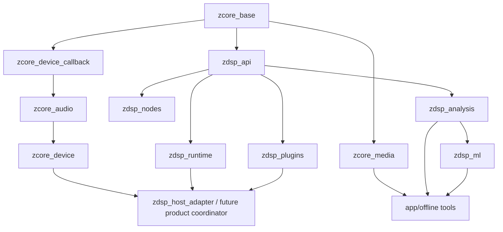

# `zcore` and `zdsp` native design

Status: active implementation standard (Phase 3A/3B/3C/3D standalone hosts present)

Last reviewed: 2026-08-30

This document defines the language profile, component boundaries, design
patterns, target layout and dependency policy for the native SingZ audio
foundation. It complements the system-level
[DSP graph plan](DSP-GRAPH-PLAN.md) and the
[implementation research](DSP-IMPLEMENTATION-RESEARCH.md).

The names `zcore` and `zdsp` describe two source packages, not two monolithic
libraries. Each package produces narrow CMake targets so an audio callback does
not inherit codecs, ONNX Runtime, plug-in SDKs or product bindings it never
uses.

Phase 0B prerequisite implementation note: `zcore_device` remains the mixed
control/delivery/provider compatibility target, while
`zcore_device_callback` is its strict callback-only leaf. The leaf owns sample
conversion, timestamp projection, the prepared SPSC producer and notification
endpoint; it is compiled as C++20 without exceptions/RTTI, with hidden
visibility and an actual-target-derived forbidden-facility scan. Lifecycle,
inventory, platform providers, threads and framework links remain in
`zcore_device`. The generated iOS `SingzCore` pod also
remains a broad device/media/analysis/ORT packaging exception; replace it with
component pods or a CMake-built XCFramework with isolated flags before native
graph rendering.

## Why the current layout will not scale

PR #13 correctly proved one reusable implementation across four operating
systems, but its temporary home under `mobile/native/core` now mixes concerns:

- device capture, clocks, wake primitives and channel conversion;
- live and offline analysis, melody, beats and resampling;
- WAV/FLAC media I/O;
- ONNX-backed inference and stem splitting;
- a native CLI and Android JNI binding;
- platform implementations and test injection.

The host CMake build creates one `singz_core` and publicly links FLAC and
threads. Android manually repeats a different source list and enables
exceptions/RTTI on the whole shared library because ONNX Runtime needs them.
iOS consumes a generated copy through a broad pod glob. C++17 is specified in
three places even though the generated React Native Xcode project already uses
C++20. Adding one source or changing one dependency can therefore produce
different native products on host, Android and iOS.

The good existing boundary should remain: `AudioInputBackend` owns control-side
open/start/stop while the callback pushes through a plain function pointer.
The existing ring also correctly requires lock-free 32-bit atomics because
SingZ still ships armeabi-v7a, where 64-bit atomics may use a lock. The redesign
generalizes these decisions instead of replacing them for novelty.

## Package and dependency boundaries



Rules:

- `zcore_base` contains general status/result, bounded utility/identity types
  and units whose meaning is shared outside DSP, plus platform/compiler
  definitions. It has no audio device, codec or framework dependency.
- `zcore_audio` contains the owning/control half of the device capture
  transport and bounded diagnostics. Its CMake target links
  `zcore_device_callback` transitively for compatibility; the two targets
  remain separate static-library artifacts. It does not own graph buses or
  process contexts.
- `zcore_device_callback` contains only callback-reachable sample conversion,
  timestamp projection, a narrow SPSC producer view, notification code and the
  full-duplex `AudioHost` render-thunk leaf.
  Prepared storage remains owned by `zcore_audio`; the callback leaf headers
  contain no owning transport or consumer API. It owns no thread, provider,
  framework or device lifecycle policy.
- `zcore_device` contains `AudioHost`, inventory/session contracts and the
  selected platform backend targets. It does not know about `zdsp`; the product
  coordinator installs a render function plus opaque context. Its prepared
  planar SPSC FIFO is a device-domain transport: on Windows one long-lived
  STA/MMCSS owner owns both endpoint clients and services. Its capture action
  publishes timestamp spans, and its render action alone consumes them and
  invokes the graph. Its prepared owning storage stays in `zcore_device`, while the
  allocation-free hot FIFO methods compile in `zcore_device_callback` and are
  covered by the callback-source policy scan. WASAPI interfaces never cross
  their owner apartments. CMake requires the FIFO hot implementation to remain
  in that scanned target, preventing a source-list edit from silently dropping
  coverage. The owning FIFO header deliberately stays outside the forbidden-
  token scan because it contains off-RT prepared vectors.
  On iOS, one RemoteIO output render callback is the graph clock and can pull
  preallocated input from the same unit for prepared duplex sessions. Its
  callback is an explicit C++ RT leaf with a whole-source, manifest-derived
  policy scan that follows transitive quoted and approved-project angle
  includes while allowlisting only the system/framework headers the leaf uses;
  macro-expanded, continued and otherwise nonliteral include directives fail
  closed rather than delegating unseen resolution to the preprocessor, and the
  continuation check covers LF, CRLF and bare-CR source encodings; the
  `%:` alternative token for `#` and Apple `#import` directives are forbidden
  throughout the closure, and comments may not obscure directive names;
  the surrounding Objective-C++ translation unit contains only
  non-real-time route inventory, session validation and notification-observer
  ownership. Negative gates prove that omitted helper membership, hidden
  quoted/angle allocation helpers and comment-only marker names cannot bypass
  the scan.
  On Android, Java owns endpoint/route inventory while a dormant Oboe provider
  owns an explicit output-first paired-stream lifetime. Its output data
  callback is the graph clock and performs bounded nonblocking input reads,
  exact sparse map conversion and silence containment in preallocated storage.
  It deliberately does not use Oboe's `FullDuplexStream`; input scratch is
  sized from the physical input extent, startup drain/cushion/discard is
  bounded, and packed admission plus an outer-entry count protect teardown.
  The Android callback leaf has its own manifest/closure source scanner and
  `-fno-exceptions -fno-rtti` source flags. The provider remains outside
  product playback/focus until the Phase 4 cutover.
- `zcore_media` contains WAV/FLAC and later streaming decode. It never appears
  in the live graph's transitive link interface.
- `zdsp_api` contains the foundational DSP-facing clock, bus, process,
  processor, parameter/event and latency contracts. Its strong wrappers are
  part of that append-compatible interface, not general `zcore` units.
- `zdsp_runtime` contains graph compilation, immutable snapshots, the real-time
  arena, buffer planner, runner and retirement.
- `zdsp_host_adapter` is the callback-safe higher layer that links
  `zcore_device` and `zdsp_runtime`, maps planar host buses/times into
  `ProcessContext`, and contains a rejected render to silence. It is a
  standalone conformance component in Phase 3A, not product playback.
- `zdsp_nodes` contains prepared built-in real-time processors.
- `zdsp_analysis` contains live taps and offline music-analysis algorithms.
- `zdsp_ml` contains ONNX/other inference adapters. It is not linked into a
  process that only needs device I/O and ordinary DSP.
- `zdsp_plugins` contains format-neutral hosting plus separately gated VST3,
  AU and CLAP adapters.
- UI, Electron, React Native, JNI, Swift/Objective-C and Java/Kotlin types stay
  in product bindings, never in public `zcore` or `zdsp` headers.

`zcore` never depends on `zdsp`. In Phase 0B `zdsp_api` and `zdsp_runtime` link
only `zcore_base`; neither links `zcore_audio`. The product `AudioHost`
coordinator is the adapter boundary: it consumes device/capture values from
`zcore_audio`/`zcore_device`, explicitly constructs the corresponding
`zdsp_api` clock, bus and process values, and invokes the runner. This avoids
duplicating graph contracts in `zcore_audio` and avoids the forbidden
`zcore`→`zdsp` dependency. The Phase 3A reusable `zdsp_host_adapter` is that
higher layer linking both sides; it does not move DSP contracts into the
device layer. It remains disconnected from Electron and React Native output,
whose Web Audio/RNAudioAPI engines retain sole ownership. The broad generated iOS pod is the documented
Phase 0A packaging exception, not an acceptable graph-runtime dependency.
During Phase 2 the allocating fixed-ratio resampler and YIN remain under
`zcore/legacy`, but ownership is split: the neutral `zcore_resample` target is
shared by media preparation and analysis, while `zcore_live_analysis_compat`
contains YIN and composes that neutral converter. The compatibility target is
linked by both the `zcore_legacy` facade and `zdsp_analysis`. Both remain
ordinary-thread-only and must eventually move behind neutral public locations
without weakening the strict `zcore_device_callback` leaf.

The unified Windows capture/render event loop still lives in the large provider
translation unit. Its hot body obeys the same no-allocation/no-lock/no-I/O
contract, but Microsoft SDK/COM ownership code prevents that whole file from
joining the portable callback compile-policy target. Extracting the event-loop
hot bodies behind prepared POD views is explicit pre-product-cutover debt; the
current required-membership scan covers the portable graph callback and FIFO
hot methods, not the entire Windows provider file.

The current Windows owner entry point is `noexcept`, and all expected control-
path allocation is completed or caught before audio starts. A truly fail-closed
catch for an unexpected construction/allocation exception after either client
has started still needs an owner-thread scope guard that checks `Stop` on both
clients before same-apartment COM unwind and publishes a nonallocating terminal
status. Adding only a broad catch would risk releasing an active client without
that checked stop, so this remains explicit pre-product-cutover debt rather
than a false terminate-safety claim.

## Repository layout

```text
CMakeLists.txt                    # native superbuild; options and add_subdirectory only
CMakePresets.json                 # checked-in host debug/release presets
cmake/
  CheckZcoreBoundaries.cmake
  SingZRealtimeTarget.cmake
third_party/native/
  CMakeLists.txt                  # pinned wrapper targets and license inventory
  flac/

zcore/
  CMakeLists.txt
  include/zcore/
    base/                         # General Result/units/bounded IDs
    audio/                        # Device buffers, capture time, transport
    device/                       # AudioHost and route/session contracts
    media/                        # non-RT codec/source contracts
  src/
    base/
    audio/
    device/
    media/
  platform/
    macos/                        # AUHAL host and Core Audio inventory
    windows/                      # WASAPI; ASIO remains a separate target
    ios/                          # RemoteIO and AVAudioSession adapter
    android/                      # Oboe/AAudio and route policy
  tests/

zdsp/
  CMakeLists.txt
  include/zdsp/
    processor.h
    process_context.h
    graph_description.h
    parameter_event.h
  src/
    graph/                        # validation, compiler, latency and buffer plans
    runtime/                      # runner, arena, snapshots, epochs, queues
  nodes/
    basic/                        # gain, mix, channel map, delay, meter
    filters/
    dynamics/
    time/                         # resample/stretch/oversampling adapters
    analysis/
  backends/
    scalar/
    accelerate/                   # Apple vDSP implementation
    highway/                      # optional portable SIMD implementation
  offline/                        # melody, beats, stem analysis/inference adapters
  plugins/
    api/
    vst3/
    au/
    clap/
    bridge/
  tests/
  benchmarks/

tools/native/                     # singz-analyze and future graph renderer
src/main/native/                  # Electron/product host binding
mobile/native/bindings/android/  # package-specific JNI only
mobile/ios/SingzCore/             # product pod/Objective-C++ wrappers only
tests/native/integration/         # cross-package and device-fake tests
```

Files are grouped by responsibility, then platform, rather than accumulating
suffixes in one directory. Platform implementations remain separate classes
and separate files. Public headers mirror their installed include path; private
headers stay beside implementation and cannot be included by consumers.

The authoritative library definitions live in the root CMake build. Android
uses `add_subdirectory()` and links the same targets instead of repeating
source lists. During the transition, the iOS materialized pod copy remains a
generated packaging adapter; the durable goal is a `zcore`/`zdsp`-owned pod or
XCFramework that consumes those component definitions, never a second editable
source tree.

## CMake policy

Use target properties throughout:

```cmake
add_library(zcore_audio STATIC)
add_library(SingZ::zcore_audio ALIAS zcore_audio)
target_compile_features(zcore_audio PUBLIC cxx_std_20)
target_include_directories(zcore_audio
  PUBLIC "$<BUILD_INTERFACE:${CMAKE_CURRENT_SOURCE_DIR}/include>")
target_link_libraries(zcore_audio PUBLIC SingZ::zcore_base)

add_library(zcore_device_callback STATIC)
add_library(SingZ::zcore_device_callback ALIAS zcore_device_callback)
target_compile_features(zcore_device_callback PUBLIC cxx_std_20)
target_link_libraries(zcore_device_callback PUBLIC SingZ::zcore_base)
singz_configure_realtime_target(zcore_device_callback)

target_link_libraries(zcore_audio PUBLIC SingZ::zcore_device_callback)

add_library(zdsp_runtime STATIC)
add_library(SingZ::zdsp_runtime ALIAS zdsp_runtime)
target_compile_features(zdsp_runtime PUBLIC cxx_std_20)
target_link_libraries(zdsp_runtime
  PUBLIC SingZ::zdsp_api)
singz_configure_realtime_target(zdsp_runtime)
```

CMake's official guidance recommends
[`target_compile_features`](https://cmake.org/cmake/help/latest/guide/tutorial/In-Depth%20CMake%20Target%20Commands.html)
instead of a repository-wide language-standard variable. `PUBLIC`, `PRIVATE`
and `INTERFACE` usage requirements must reflect actual header exposure. A
third-party dependency is `PRIVATE` unless a public header unavoidably names
its type; public native headers should avoid doing so.

Additional rules:

- List first-party and vendored source files explicitly. CMake itself
  [discourages source globs](https://cmake.org/cmake/help/latest/command/file.html#filesystem)
  because generators may miss additions and every build pays a rescan cost.
- Use checked-in [CMake presets](https://cmake.org/cmake/help/latest/manual/cmake-presets.7.html)
  for macOS arm64/x64, Windows x64, Android ABIs, sanitizers and benchmarks.
- Build options select targets/backends, not `#ifdef` forests inside portable
  implementation. OS checks belong primarily in platform CMake files.
- Export namespaced targets; never expose raw include/link flags to apps.
- Default symbol visibility is hidden. Export only the narrow C or C++ API
  required by the product binding.
- Do not download dependencies during ordinary configure/build. Vendor small
  source dependencies or fetch them in a separate pinned bootstrap step with
  checksums, notices and an offline cache.
- Keep compiler warnings and hardening target-scoped. Third-party code compiles
  under wrapper targets without inheriting SingZ warning-as-error flags.
- `RelWithDebInfo` is the profiling build. Release may enable measured IPO/LTO;
  debug/sanitizer builds are correctness tools, never latency evidence.

## Language baseline: C++20 with two execution profiles

C++20 is the minimum for new `zcore`/`zdsp` APIs after toolchain gates pass on
MSVC, Apple Clang, Android NDK 27 and the armeabi-v7a build. Do not require
C++23 yet. The migration first changes target declarations and CI, then adopts
features; it does not mix a language bump with algorithm changes.

Useful zero-cost C++20 features include:

- `std::span` for callback-scoped non-owning audio/control views;
- `std::bit_cast` and `std::endian` for explicit representation work;
- `constexpr`/`consteval` for validated tables and descriptors prepared at
  compile time;
- concepts for constraining internal kernel templates;
- `[[nodiscard]]`, `[[maybe_unused]]` and scoped enums for safer contracts;
- designated initialization only where compiler parity and readability are
  proven.

Do not expose `std::jthread`, `std::stop_token` or `atomic::wait` in portable
contracts. The pinned NDK 27 libc++ hides parts of that API behind experimental
feature flags. A small `zcore` control-thread/cancellation abstraction uses the
portable `std::thread` plus an atomic stop flag and platform wake primitive;
where a standard facility is available it may be an internal implementation
detail. None of these mechanisms is callback synchronization.

The [C++ Core Guidelines](https://isocpp.github.io/CppCoreGuidelines/CppCoreGuidelines.html)
explicitly note that dynamically allocating standard containers are unsuitable
for some hard-real-time work and that hard-real-time environments may require
systematic status returns instead of exceptions. SingZ therefore has two
profiles:

| Feature | Control, build, scan and offline threads | Real-time callback/runtime |
| --- | --- | --- |
| RAII, `unique_ptr`, `vector`, `string` | Preferred | Existing prepared storage may be viewed; no mutation that can allocate or destroy |
| Exceptions and RTTI | Allowed inside isolated adapters such as ORT; catch at boundary | Disabled for `zdsp_runtime` and built-in RT node targets |
| `shared_ptr` | Allowed when ownership genuinely is shared | Never acquired/released; final release and atomic shared pointers can lock/destroy |
| `std::function` | Allowed for ordinary callbacks | No; use function pointer plus opaque context or fixed-capacity callable proven allocation-free |
| Coroutines/futures | Allowed where useful off RT | Forbidden |
| Project control-thread/stop abstraction | Ordinary lifecycle; standard facilities may be used behind a feature gate | Never start/stop/join in callback |
| Mutex, semaphore, condition variable or blocking wait | Allowed where supported | Forbidden; only specified SPSC atomics and the separately reviewed bounded parallel spin policy |
| `pmr` and arenas | Useful while compiling snapshots | Render arena is already frozen; no allocation calls |
| ranges/algorithms | Preferred when clear and measured | Permitted only when generated work is bounded, allocation-free and benchmark-equivalent |
| filesystem, format, iostream, locale | Allowed | Forbidden |

Every function reachable from a device callback is `noexcept`. Preparation
returns a `[[nodiscard]] Result<T>`/`Status`; C++20 lacks `std::expected`, so
SingZ should own one small non-allocating result type rather than leak a large
utility dependency through public headers. Error strings are built off RT.

Do not globally enable `-ffast-math`, `/fp:fast` or `-march=native`. Fast-math
can invalidate NaN/Inf containment and reproducibility, and native ISA flags
produce binaries that fail on older fleet CPUs. A measured kernel may opt into
FMA/relaxed math locally with scalar parity and error bounds. Shipping x64
keeps a conservative baseline and uses runtime dispatch; arm64 may assume NEON.

## API and design patterns

### Strong units and views

Do not pass unrelated time quantities as naked `double`/`uint64_t`. Use small
trivial wrappers such as `SampleRateHz`, `FrameCount`, `FramePosition`,
`HostTimeNs`, `LatencyFrames` and `RouteGeneration`. Conversions are explicit
and happen outside inner sample loops.

Ownership follows semantic boundary, not spelling. A general unit used with
the same meaning across native subsystems belongs in `zcore_base`. A wrapper
whose validity, versioning or clock meaning is defined by the processor
contract belongs in `zdsp_api`, even if a device-facing `zcore_audio` value has
a similar representation. The product host converts explicitly between them;
`zcore_audio` must not include `zdsp` merely to avoid a one-line conversion.

`AudioBusView` is non-owning and trivial: channel pointers, channel/frame
counts, stride/layout and capacity. Const input and mutable output are separate
types. A view never extends driver-buffer or arena-slot lifetime.

### Prepare/compile/process

Node factories and descriptive objects live on the control side. `prepare()`
creates durable state; the graph compiler lowers it into a data-oriented list:

```cpp
using RenderFn = void (*)(void* state, ProcessContext&) noexcept;

struct RenderOp {
  RenderFn render;
  void* state;
  BufferBinding inputs;
  BufferBinding outputs;
};
```

One indirect call per node per block is acceptable; virtual or branch-heavy
dispatch per sample is not. A virtual control-side `ProcessorFactory` may
prepare nodes, while the render plan holds function thunks and stable state
addresses. Do not use `dynamic_cast` or string lookup in the runner.

### Immutable snapshot plus epoch retirement

The control thread builds a complete snapshot, then publishes its pointer at a
block boundary. The render thread never edits topology. Handles are stable IDs
plus generations, not owning pointers. Old snapshots and node destructors are
retired off RT after every relevant render worker acknowledges the epoch.

RAII remains the right control-plane ownership mechanism, but resource lifetime
and audible graph lifetime are explicit and separate. A retained snapshot must
not keep registration, MIDI or file side effects alive accidentally.

### Strategy without framework ownership

Scalar, Accelerate and Highway kernels implement a narrow internal strategy
interface selected during preparation. Platform audio hosts implement the
`AudioHost` control contract. Plug-in formats implement `PluginFormat`.
None owns or subclasses the public graph runtime.

Avoid a service locator, global audio singleton or abstract factory forest.
The product composition root constructs the device backend, graph compiler,
runner and session coordinator explicitly. Tests inject those dependencies
through constructors/factories instead of production-wide test macros.

### ABI boundaries

Static C++ targets may share internal C++20 types when built by one toolchain.
Shared-library, plug-in, JNI/Swift and future bridge boundaries use a versioned
C ABI or their platform ABI with POD descriptors, explicit sizes and opaque
handles. Never expose STL containers, exceptions, allocators or C++ class
layout across those boundaries.

Phase 0B's `ProcessorVTable` is the first category only: same-toolchain static
C++20 despite its POD shape and version fields. A future shared boundary needs
a separate exported `extern "C"` factory, explicit calling/export conventions,
fixed-width C POD, opaque handles and output status; it must not return the
internal C++ vtable directly.

## Memory and cache policy

- The graph compiler computes buffer liveness, aligns slots and records the
  exact arena high-water mark. Runtime allocation is impossible by API.
- Prefer structure-of-arrays/planar samples for kernels and channel loops.
  Interleave only at a driver or plug-in boundary that requires it.
- Keep immutable coefficients adjacent; keep producer and consumer cursors on
  separate cache lines. Do not assume `hardware_destructive_interference_size`
  has one stable ABI value—use a reviewed project constant per target.
- Preserve the current lock-free 32-bit SPSC cursor rule while armv7 ships.
  Widen statistics off RT. Every RT atomic has an
  `is_always_lock_free` assertion for every supported ABI.
- Power-of-two queue capacity may replace modulo with a mask when measurement
  justifies the constraint. Correct bounded behavior matters more than that
  micro-optimization.
- Stack use per processor is bounded and audited; large scratch arrays come
  from prepared arena slices.
- Prefault/warm memory, dispatch tables, FFT plans, resamplers and plug-ins
  before device start. Flush denormals according to the platform policy.
- No reference counts, destructors or arbitrary user callbacks run from the
  device callback.

## Libraries

The default is a small standard-library core plus native platform APIs. Add a
dependency only when it beats a SingZ scalar reference on representative
hardware and its license, binary size, initialization and RT behavior are
known.

| Library/API | Target boundary and decision |
| --- | --- |
| Core Audio/AudioToolbox, WASAPI, Oboe/AAudio | Required platform implementations in separate `zcore_device_*` targets. Oboe is preferred over handwritten Android-version branching. |
| libFLAC | Retain, but only behind `zcore_media`; never a public/transitive dependency of device or graph runtime. |
| ONNX Runtime | Retain for `zdsp_ml`/offline analysis only. Its exception/RTTI requirement must not change compile flags for RT targets. |
| Apple Accelerate/vDSP | Preferred measured Apple SIMD/FFT backend; no extra distribution dependency. |
| [Google Highway](https://github.com/google/highway) | Optional portable SIMD backend. Runtime dispatch has minor first-call CPU detection, so update/warm the selected target before audio starts. Keep a scalar implementation. |
| Signalsmith Stretch | Evaluate the native C++ library as one prepared time/pitch node; pin version/license and retain phase-coherent whole-song-bus semantics. |
| PFFFT or another permissive FFT | Benchmark only if vDSP is unavailable or insufficient. Plans and scratch allocate off RT; do not expose its types. |
| Resampler library | Do not choose by quality marketing alone. Compare the existing resampler and permissive candidates for dynamic-ratio drift correction, small-block delay, CPU and reset/discontinuity behavior. |
| [VST3 SDK](https://github.com/steinbergmedia/vst3sdk/commit/9fad9770f2ae8542ab1a548a68c1ad1ac690abe0) | Pin the upstream commit named `VST SDK 3.8.0`, `9fad9770f2ae8542ab1a548a68c1ad1ac690abe0`, plus its recorded gitlinks in `zdsp_plugins_vst3`; upstream publishes no GitHub release/tag for this point. Preserve root/submodule licenses and `VST3_Usage_Guidelines.pdf`. This does not change ASIO's separate licensing gate. |
| JUCE/Tracktion | Reference or separately licensed comparison only; neither defines SingZ's ABI or target graph. |
| SPSC queue/RT arena | Keep the small SingZ-owned implementations because their ownership, overflow and armv7 atomic contracts are product-specific and auditable. |
| [Google Benchmark](https://github.com/google/benchmark) | Development-only `zdsp_benchmarks` dependency. Use `DoNotOptimize`, repetitions/statistics and custom throughput/deadline counters; never link it into products. |

Avoid Boost-sized public dependencies, general-purpose job systems, hidden
allocators, automatic sample-format conversion and header-only libraries that
multiply compile time/code size across every node without measured benefit.

## Performance build and measurement policy

- Scalar correctness is authoritative. Each optimized kernel has parity,
  impulse, sweep and randomized tests before it can be selected.
- Benchmark 48 kHz blocks of 16, 32, 64, 128 and 256 frames, mono through the
  maximum practical bus layout. Report ns/frame/channel as well as percentage
  of the callback deadline.
- Benchmark cold preparation separately from warmed steady-state processing.
  No first-call dispatch, page fault or lazy initialization is allowed in the
  latter.
- Google Benchmark compares kernels; a fake-host deadline harness measures
  complete graphs and jitter; physical loopback/device tests measure the system.
  None substitutes for the others.
- Use compiler optimization reports, assembly inspection and hardware counters
  only after profiles identify a hot kernel. Measure copies and cache misses,
  not only arithmetic throughput.
- Fuse adjacent trivial built-ins only when automation, metering, bypass and
  serialization semantics remain identical.
- IPO/LTO and profile-guided optimization are opt-in release experiments with
  binary-size, startup and parity gates. Do not use benchmark-only flags in
  normal products.
- Sanitizers, debug iterators and thread instrumentation run separate presets.
  Their timing is never reported as product latency.
- Record performance baselines by CPU/device and fail only on statistically
  meaningful regressions; noisy shared CI is a correctness/build gate, while
  the Mac/Zen Quadro and Dell are controlled performance gates.

## Migration sequence

1. Move with history, establish the root superbuild and get identical tests on
   host, Android and iOS before changing behavior.
2. Raise component targets to C++20 and prove MSVC, Apple Clang, NDK arm64 and
   armv7 builds. Replace global standard flags with target features.
3. Split `zcore_base`, `zcore_audio`, `zcore_device` and `zcore_media`; keep a
   temporary `SingZ::zcore_legacy` compatibility target only for migration.
4. Create the format-neutral `zdsp_api` target and DSP-facing clock/bus/process
   contracts without changing application playback. Keep device transport in
   `zcore_audio`; adapt between the two only in a host/product layer that links
   both targets.
5. Isolate the current rate converter once in neutral `zcore_resample`; use it
   from media preparation and from `zcore_live_analysis_compat`, which owns the
   current YIN implementation. Link the compatibility target from both the
   legacy facade and `zdsp_analysis` while preserving outputs and tolerances.
   ONNX/stem work remains separately owned; DSP adapters may depend on
   `zdsp_api`.
6. Make Android link the root targets rather than repeat source lists. Keep the
   iOS copy generated until a dedicated pod/XCFramework integration passes
   clean and stale-binary tests.
7. Add serial `zdsp_runtime`, then the smallest gain/meter nodes.
8. Add scalar-versus-platform benchmark targets and only then introduce vDSP,
   Highway or another optimized backend.
9. Delete the compatibility target and fail CI if a product pulls media, ML or
   plug-in SDK dependencies into the real-time runtime unintentionally.

Each split is link-map tested. “The app builds” is not enough: CI records the
targets and external libraries present in the desktop, iOS and Android audio
host artifacts so architectural dependency creep is visible.
